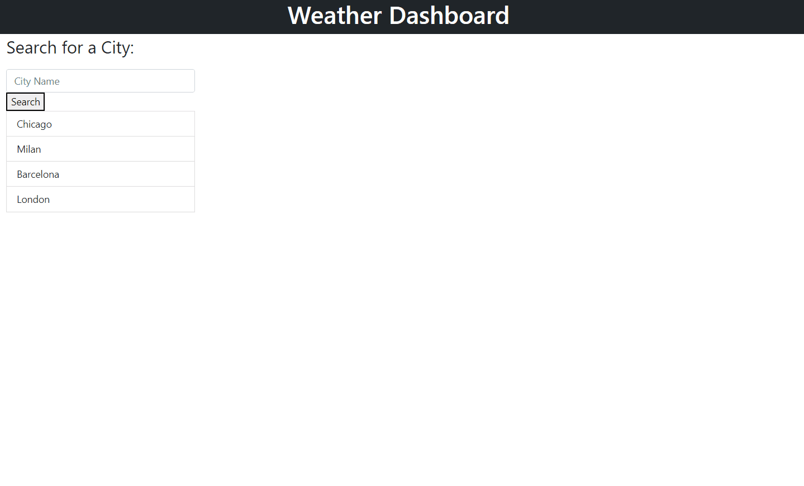

<h1> Weather Dashboard </h1>

## Link:

<a href="https://mbenson025.github.io/weather-dashboard/">Link to deployed app</a>

## Table of Contents

[About](#about) - [Technologies Used](#technologies-used) - [Installation](#installation) -[Instructions](#instructions) -[Screenshots](#screenshots) -[Live-Demo](#live-demo) -[Contact](#contact) -[License](#license)

  

## About

This application allows a user to be able to search for a city and receive information about the current and future weather. Weather features include temperature, wind speed and humidity.

The UV Index is displayed under the current day with a color displaying the amount of risk associated with exposure.

There is a recent search feature that adds cities searched below the search bar. This list persists with localStorage and the user is able to click on any of the cities for a quick search.

 

## Technologies Used:

openweathermap.org APIs, jQuery and ajax. Languages used: HTML5, CSS, JavaScript

 

## Installation

Download/clone repository or click link for browser link.

 

## Instructions

-Type the name of a city and click search or press the "enter" key
-Current weather and five day forecast appear on screen
-Recent searches are added below search field
-Click on a recent search for a quick city lookup

 

## Screenshots:

 

 

 

## Live Demo:

 

 

## Contact:

 

Mason Benson - mbenson025@gmail.com

GitHub Profile - https://github.com/mbenson025

 

 

## License:

 

MIT License

Copyright (c) 2022 Mason Benson

Licensed under the [MIT](LICENSE) license.
